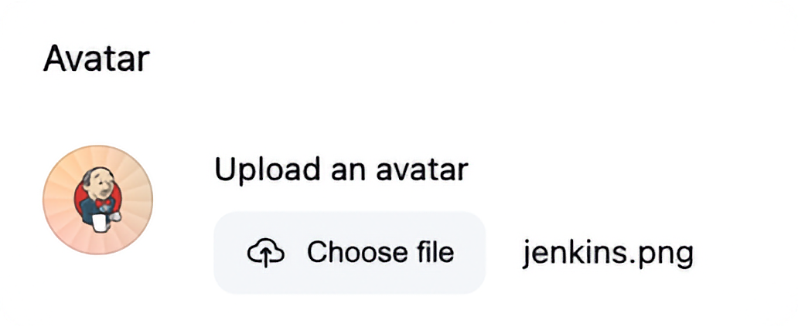

# Avatar

Allows users to upload avatars.

## Getting started

Go to your User Account page (Click your name in the top right of Jenkins and then click Account)
Click 'Choose file' in the Avatar section and then Save.

To remove an avatar hover over the existing avatar and click the clear icon and then save.

## Contributing

Refer to our [contribution guidelines](https://github.com/jenkinsci/.github/blob/master/CONTRIBUTING.md)

## LICENSE

Licensed under MIT, see [LICENSE](LICENSE)